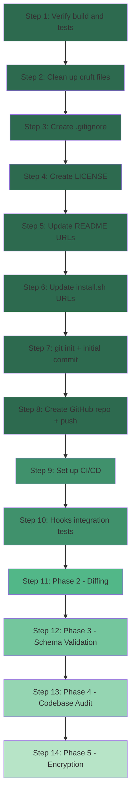

# graxaim — Roadmap Execution Plan

**Date:** March 19, 2026  
**Status:** Draft — awaiting approval  
**Scope:** Repo setup + publish + complete Phases 2–5 of the roadmap

---

## Current State Assessment

### What exists (Phase 1 — Complete)
- **10 commands** implemented: `init`, `use`, `list`, `current`, `create`, `delete`, `rename`, `edit`, `run`, `export`
- **Core modules**: `env_file.rs`, `project.rs`, `config.rs`, `profile.rs`, `hooks.rs`
- **UI modules**: `output.rs`, `picker.rs`, `redact.rs`
- **Integration tests**: 5 test files (22 integration tests + 42 unit tests)
- **Hooks system**: Core `hooks.rs` implemented; CLI flags `--no-hooks` / `--strict-hooks` wired through `cli.rs` → `main.rs` → `use_profile.rs`
- **Binary compiles** (a `target/debug/graxaim` binary exists)

### What's missing
- **No git repository** — project has never been committed
- **No `.gitignore`** file in the workspace root
- **No CI/CD** — `.github/workflows/ci.yml` referenced in `CLAUDE.md` but doesn't exist
- **Cruft files** that shouldn't be in the repo: `repomix-output.xml`, `Docs prd.md` (duplicate of `docs/PRD.md`), various `*_SUMMARY.md`, `*_STATUS.md`, `*_TODO.md`, `BUILD_TROUBLESHOOTING.md`
- **Placeholder URLs** — README references `yourusername` instead of `gabriel-taufer`
- **Phases 2–5** not implemented: diffing, schema validation, codebase audit, encryption
- **No `LICENSE` file**
- **Hook integration tests** not yet written (test file `tests/integration/hooks_test.rs` mentioned in `CLAUDE.md` but doesn't exist)

---

## Execution Plan

### Step 1: Verify Build & Tests

Confirm the project compiles cleanly and all tests pass before any other changes.

- [ ] Run `cargo check` — verify compilation
- [ ] Run `cargo clippy` — fix any lint warnings
- [ ] Run `cargo test` — verify all 64 tests pass
- [ ] Run `cargo fmt --check` — verify formatting
- [ ] Fix any issues discovered

### Step 2: Repository Cleanup

Remove files that shouldn't be committed to a public repo.

**Files to delete:**
- `repomix-output.xml` — 198KB generated file, not source
- `Docs prd.md` — duplicate of `docs/PRD.md` (note the space in the filename)
- `BUILD_TROUBLESHOOTING.md` — internal troubleshooting notes
- `HOOK_SYSTEM_STATUS.md` — internal status tracking
- `HOOKS_IMPLEMENTATION_TODO.md` — internal todo tracking
- `IMPLEMENTATION_SUMMARY.md` — internal summary
- `PHASE1_VERIFICATION.md` — internal verification checklist
- `RENAME_SUMMARY.md` — internal rename tracking

**Files to keep:**
- `README.md` — public-facing documentation
- `QUICKSTART.md` — useful user-facing guide
- `CLAUDE.md` — development reference (useful for contributors)
- `install.sh` — installer script
- `docs/PRD.md` — product requirements
- `Cargo.toml`, `Cargo.lock` — Rust project files
- `src/`, `tests/` — source code

### Step 3: Create `.gitignore`

Standard Rust `.gitignore` plus project-specific entries:

```
# Rust build artifacts
/target/

# IDE
.vscode/
.idea/
*.swp
*.swo

# OS
.DS_Store
Thumbs.db

# graxaim project-specific test artifacts
tests/fixtures/*/
```

### Step 4: Create `LICENSE` File

MIT license (as declared in `Cargo.toml`).

### Step 5: Update README.md

- Replace all `yourusername` references with `gabriel-taufer`
- Update install URLs to `https://raw.githubusercontent.com/gabriel-taufer/graxaim/main/install.sh`
- Update clone URLs to `https://github.com/gabriel-taufer/graxaim.git`
- Add badges (CI status, license, crates.io once published)

### Step 6: Update `install.sh`

Replace `yourusername` placeholder URLs with `gabriel-taufer`.

### Step 7: Git Init & Initial Commit

```
git init
git add .
git commit -m "Initial commit: Phase 1 complete — core profile management"
```

### Step 8: Create GitHub Repo & Push

```
gh repo create gabriel-taufer/graxaim --public --source=. --push
```

Or manually:
1. Create repo at `https://github.com/gabriel-taufer/graxaim`
2. `git remote add origin https://github.com/gabriel-taufer/graxaim.git`
3. `git push -u origin main`

### Step 9: Set Up CI/CD

Create `.github/workflows/ci.yml` with:
- **Trigger:** push to `main`, pull requests
- **Matrix:** stable + nightly Rust on ubuntu-latest and macos-latest
- **Steps:** `cargo check`, `cargo fmt --check`, `cargo clippy -- -D warnings`, `cargo test`

### Step 10: Verify & Test Hooks Integration

The hooks system appears code-complete based on my review:
- `src/core/hooks.rs` — full `HookRunner` implementation
- `src/cli.rs` — `--no-hooks` and `--strict-hooks` flags on `Use` command
- `src/main.rs` — flags passed through to `use_profile::execute()`
- `src/commands/use_profile.rs` — `HookRunner` instantiated and `run_switch_hooks()` called

Remaining work:
- [ ] Write `tests/integration/hooks_test.rs` — integration tests that create hook scripts, run `graxaim use`, verify hooks executed in correct order
- [ ] Test edge cases: non-executable hooks, hook timeout, strict mode failures
- [ ] Verify `_leave_*` hooks work when switching FROM a profile

### Step 11: Phase 2 — Diffing

**Goal:** Compare profiles side-by-side with redacted output.

**New files to create:**
- `src/core/differ.rs` — diff engine comparing two `EnvFile` instances
- `src/commands/diff.rs` — `graxaim diff <a> <b>` command

**Modifications:**
- `src/commands/mod.rs` — add `pub mod diff`
- `src/cli.rs` — add `Diff` variant to `Commands` enum
- `src/main.rs` — wire `Diff` command routing

**Implementation details:**

```
DiffResult:
  - only_in_a: Vec of key-value pairs only in profile A
  - only_in_b: Vec of key-value pairs only in profile B
  - different: Vec of key-value-value triples where value differs
  - same: Vec of key-value pairs identical in both
```

**CLI flags:**
- `graxaim diff <a> <b>` — default: redacted values, hide identical keys
- `--no-redact` — show full values
- `--show-same` — also show identical keys
- `--all` — matrix summary comparing all profiles

**Tests:** `tests/integration/diff_test.rs`

### Step 12: Phase 3 — Schema Validation

**Goal:** Validate profiles against a TOML schema to catch config errors early.

**New files to create:**
- `src/core/schema, type validators, validation engine
- `src/commands/check.rs` — `graxaim check [name]` command
- `src/commands/schema.rs` — `graxaim schema init` and `graxaim schema generate-example`

**Type validators to implement:**
- `string` — with optional `min_length`, `max_length`, `pattern` regex
- `integer` — with optional `min`, `max`
- `port` — integer 1–65535
- `boolean` — accepts `true/false/1/0/yes/no`
- `url` — valid URL, optional `schemes` whitelist
- `email` — basic email format validation
- `enum` — value must be in a specified set
- `list` — comma-separated, optional `item_type`
- `path` — filesystem path, optional `must_exist`

**`depends_on` logic:** conditional requirements — e.g., `SMTP_PASSWORD` is required only if `SMTP_ENABLED=true`

**Schema format example** (`.graxaim/schema.toml`):
```toml
[vars.DATABASE_URL]
type = "url"
required = true
schemes = ["postgres", "mysql"]
description = "Primary database connection string"

[vars.PORT]
type = "port"
required = true
default = "3000"
```

**Tests:** `tests/integration/check_test.rs`

### Step 13: Phase 4 — Codebase Audit

**Goal:** Cross-reference env vars in source code with profiles and schema.

**New files to create:**
- `src/core/auditor.rs` — regex-based scanner for env var patterns per language
- `src/commands/audit.rs` — `graxaim audit` command

**Language patterns to detect:**

| Language | Patterns |
|----------|----------|
| JS/TS | `process.env.VAR`, `process.env["VAR"]`, `import.meta.env.VAR` |
| Python | `os.environ["VAR"]`, `os.getenv("VAR")`, `os.environ.get("VAR")` |
| Rust | `env::var("VAR")`, `env!("VAR")` |
| Go | `os.Getenv("VAR")` |
| Ruby | `ENV["VAR"]`, `ENV.fetch("VAR")` |
| PHP | `getenv("VAR")`, `$_ENV["VAR"]` |
| Docker | `${VAR}` in docker-compose.yml |

**File discovery:**
- Walk directory tree, respect `.gitignore`
- Skip common directories: `node_modules`, `target`, `.git`, `vendor`, `__pycache__`
- Use `rayon` for parallel file scanning (already a transitive dependency via `skim`)

**Report categories:**
1. **In code, missing from profiles** — needs to be added
2. **In profiles, not in code** — potentially dead
3. **In schema but not in code** — stale schema entries

**Performance target:** 10k files in under 1 second

**Tests:** `tests/integration/audit_test.rs` with fixture projects

### Step 14: Phase 5 — Encryption

**Goal:** Allow profiles to be encrypted and safely committed to git.

**New files to create:**
- `src/core/encryption.rs` — `age` crate wrappers for seal/unseal
- `src/commands/seal.rs` — `graxaim seal <name>` command
- `src/commands/unseal.rs` — `graxaim unseal <name>` command

**File convention:**
```
.env.production           → plaintext (gitignored)
.env.production.sealed    → encrypted (safe to commit)
```

**Encryption modes:**
1. **Passphrase-based** — prompted interactively, using `age::scrypt`
2. **Age identity file** — `--identity ~/.age/key.txt`, using `age::x25519`
3. **Age recipient** — `--recipient age1...`, for encrypting to someone else's key

**Commands:**
- `graxaim seal <name>` — encrypt profile → `.env.<name>.sealed`
- `graxaim seal --all` — seal all profiles
- `graxaim unseal <name>` — decrypt `.env.<name>.sealed` → `.env.<name>`

**Dependencies already in Cargo.toml:** `age = "0.10"`, `secrecy = "0.8"`

**Tests:** Unit tests in `encryption.rs`, integration tests for seal/unseal round-trip

---

## Execution Flow Diagram



**Legend:** Darker green = do first, lighter green = later phases

---

## Files to Create/Modify Summary

### New files
| File | Step | Purpose |
|------|------|---------|
| `.gitignore` | 3 | Git ignore rules |
| `LICENSE` | 4 | MIT license text |
| `.github/workflows/ci.yml` | 9 | CI/CD pipeline |
| `tests/integration/hooks_test.rs` | 10 | Hook integration tests |
| `src/core/differ.rs` | 11 | Diff engine |
| `src/commands/diff.rs` | 11 | Diff command |
| `tests/integration/diff_test.rs` | 11 | Diff tests |
| `src/core/schema.rs` | 12 | Schema validator |
| `src/commands/check.rs` | 12 | Check command |
| `src/commands/schema.rs` | 12 | Schema commands |
| `tests/integration/check_test.rs` | 12 | Schema tests |
| `src/core/auditor.rs` | 13 | Code auditor |
| `src/commands/audit.rs` | 13 | Audit command |
| `tests/integration/audit_test.rs` | 13 | Audit tests |
| `src/core/encryption.rs` | 14 | Encryption wrappers |
| `src/commands/seal.rs` | 14 | Seal command |
| `src/commands/unseal.rs` | 14 | Unseal command |

### Files to modify
| File | Steps | Changes |
|------|-------|---------|
| `README.md` | 5 | Fix GitHub URLs, add badges |
| `install.sh` | 6 | Fix GitHub URLs |
| `src/cli.rs` | 11, 12, 13, 14 | Add Diff, Check, Schema, Audit, Seal, Unseal commands |
| `src/main.rs` | 11, 12, 13, 14 | Wire new command routing |
| `src/commands/mod.rs` | 11, 12, 13, 14 | Add new module exports |
| `src/core/mod.rs` | 11, 12, 13, 14 | Add new module exports |

### Files to delete
| File | Step | Reason |
|------|------|--------|
| `repomix-output.xml` | 2 | Generated file, 198KB |
| `Docs prd.md` | 2 | Duplicate of `docs/PRD.md` |
| `BUILD_TROUBLESHOOTING.md` | 2 | Internal notes |
| `HOOK_SYSTEM_STATUS.md` | 2 | Internal tracking |
| `HOOKS_IMPLEMENTATION_TODO.md` | 2 | Internal tracking |
| `IMPLEMENTATION_SUMMARY.md` | 2 | Internal tracking |
| `PHASE1_VERIFICATION.md` | 2 | Internal tracking |
| `RENAME_SUMMARY.md` | 2 | Internal tracking |

---

## Suggested Commit Strategy

Each step should be its own commit (or PR) for clean history:

1. `chore: verify build, fix lint warnings`
2. `chore: remove internal tracking docs and generated files`
3. `chore: add .gitignore and LICENSE`
4. `docs: update README with correct GitHub URLs and badges`
5. `ci: add GitHub Actions workflow`
6. `test: add hooks integration tests`
7. `feat: add profile diffing (Phase 2)`
8. `feat: add schema validation (Phase 3)`
9. `feat: add codebase audit (Phase 4)`
10. `feat: add encryption seal/unseal (Phase 5)`
